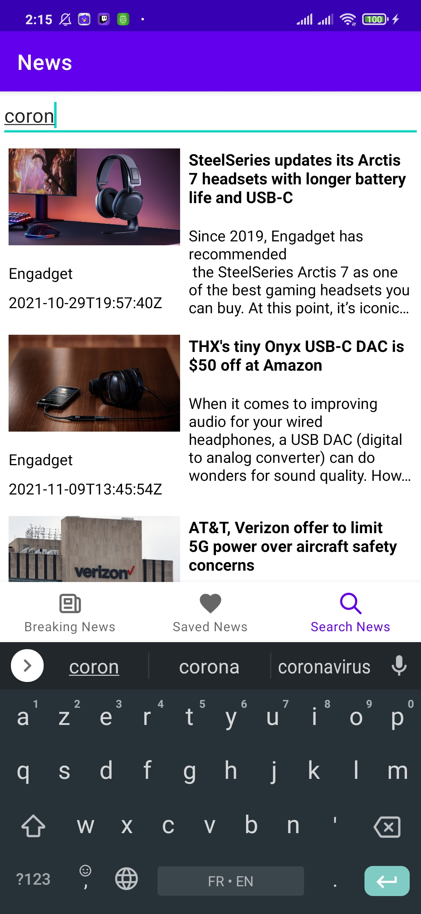
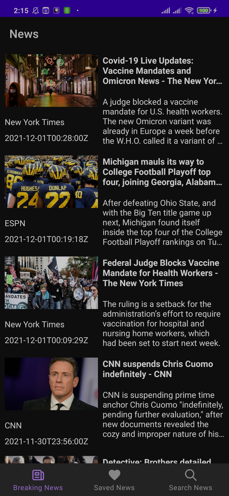

# News App

## Tech Stack :hammer_and_wrench:
- [Kotlin](https://kotlinlang.org/)
- [MVVM & Repository pattern](https://developer.android.com/jetpack/docs/guide#overview)
- [LiveData](https://developer.android.com/topic/libraries/architecture/livedata)
- [Navigation](https://developer.android.com/guide/navigation)
- [Coroutines](https://kotlinlang.org/docs/coroutines-guide.html) 
- [Retrofit](https://square.github.io/retrofit/)
- [Room](https://developer.android.com/training/data-storage/room) 
- [Glide](https://github.com/bumptech/glide)

## About App :bulb:
This app uses [NewsAPI](https://newsapi.org/) to get news. It uses Retrofit 2 to fetch and search for news from the API. 
It uses Room Library to save news as favorites and loads and removes the data from DB, 
The main aim of this sample app is show how to use the new Architecture Guidelines with Kotlin.

## Screenshots

 

 

 

 

 

 

 

